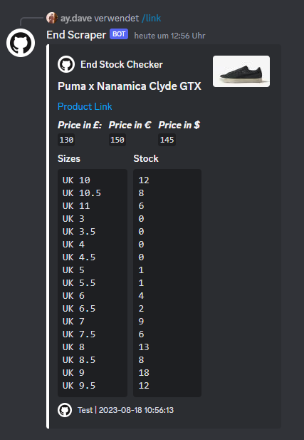

# End Stock Checker Discord Bot

A simple bot to fetch and display product details from the End website.



*Above: An example of the bot fetching product details and displaying them in Discord.*

## Setup
---

### 1. Cloning the Repository

First, clone the repository to your local machine:

```bash
git clone https://github.com/ceodavee/end-stock-checker.git
cd <your-repo-directory>
```
---

### 2. Installing Requirements

Ensure you have Python 3.x installed. Then, set up a virtual environment (optional but recommended):

```bash
python3 -m venv venv
source venv/bin/activate  # On Windows, use: venv\Scripts\activate
```

Install the required packages:

```bash
pip install -r requirements.txt
```
---

### 3. Configuring the Bot

Open `config.json` in a text editor. Fill in the required fields:

- `BOT_TOKEN`: Your bot's token which can be obtained from the [Discord Developer Portal](https://discord.com/developers/applications).
- `DISCORD_GUILD_ID`: Your Discord guild ID / Server ID. [YouTube Tutorial](https://www.youtube.com/watch?v=NLWtSHWKbAI)
- Other configurations like `COLOUR`, `URL`, `LOGO`, and `NAME` as per your requirements.
---
### 4. Running the Bot

With everything set up, run the bot using:

```bash
python main.py
```

The bot should now be running and ready to accept commands.

---
### 5. Inviting the Bot

To use the bot, you need to create a Discord bot and invite it to your server:

1. Go to the [Discord Developer Portal](https://discord.com/developers/applications) and create a new application.
2. Under the "Bot" section, click "Add Bot" to create a bot user.
3. Copy the bot token and paste it into the `BOT_TOKEN` field in `config.json`.
4. Navigate to the "OAuth2" section and select the "bot" scope. Scroll down and select the permissions required for the bot (at least "Send Messages" and "Embed Links"). Copy the generated invite link.
5. Open the invite link in your browser and select the server you want to invite the bot to. Follow the prompts to complete the invitation.
---
### 6. Using the Bot

To use the bot in Discord, invoke the `link` command and pass in a product URL to fetch its details:

```
/link <product-url>
```

The bot will display an embed with product details fetched from the End website.

## Issues and Contributions

If you encounter any issues or would like to contribute to this project, feel free to open an issue or submit a pull request.